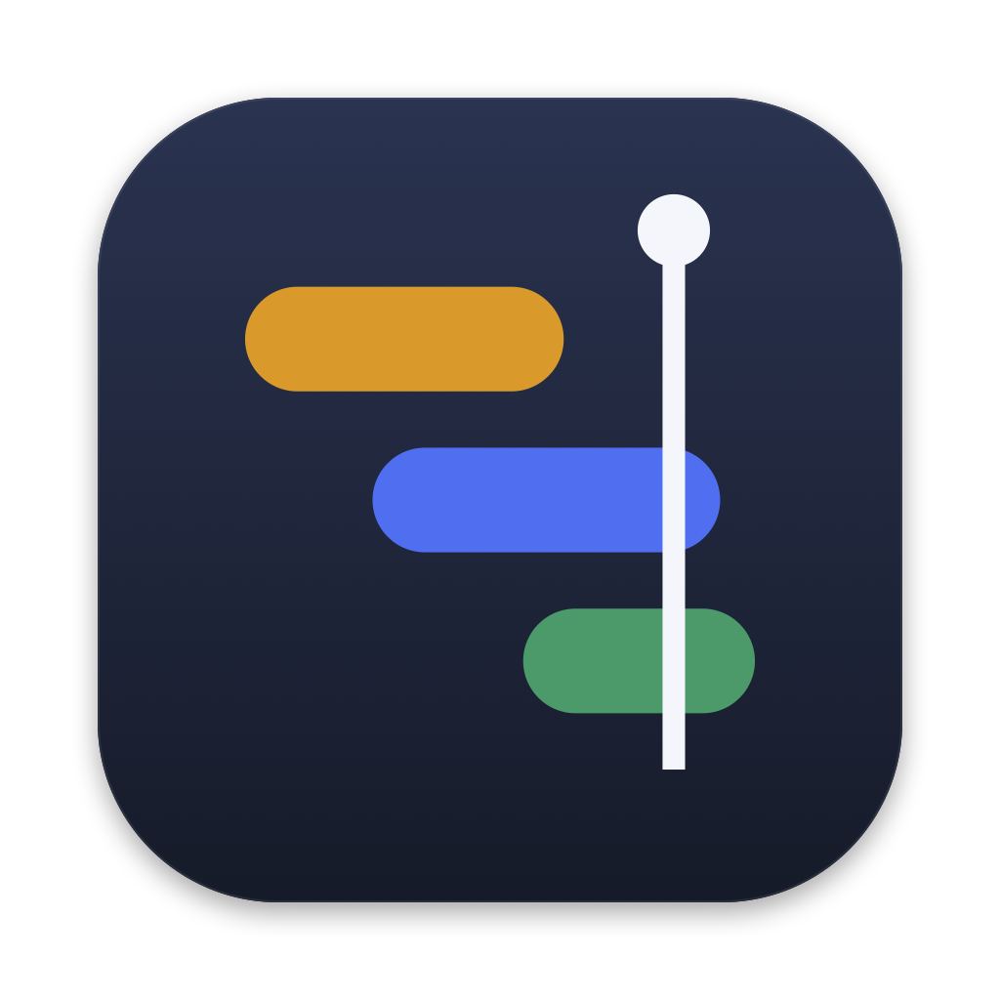
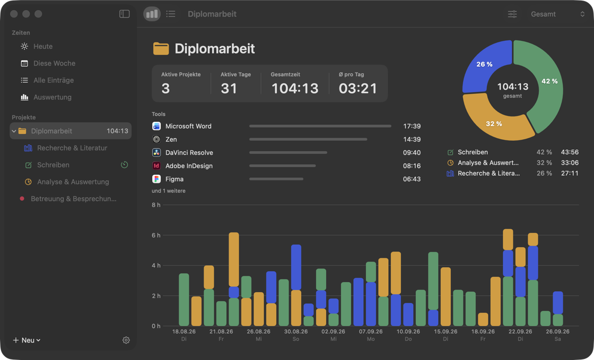
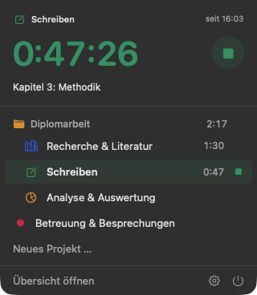
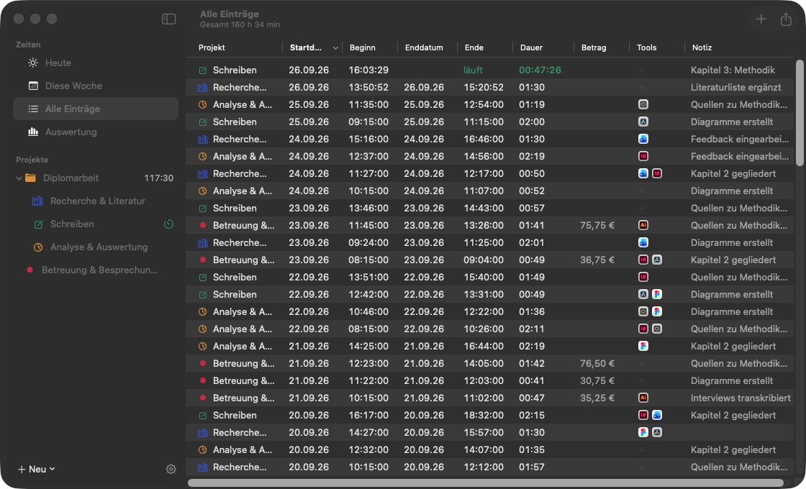
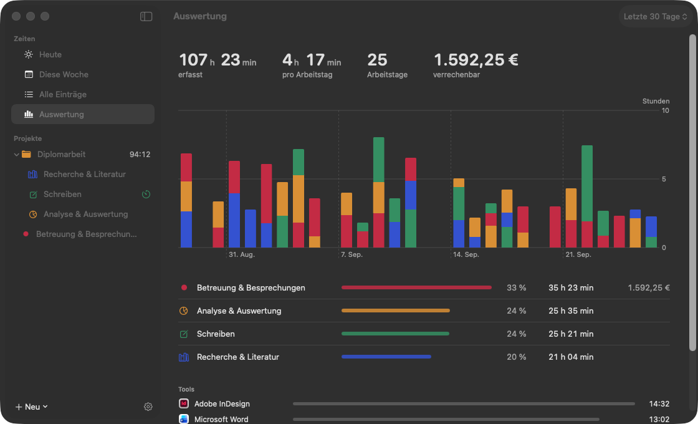
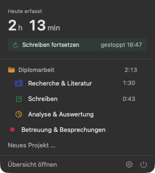
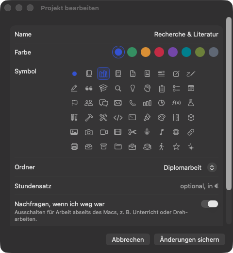
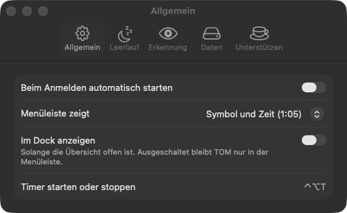

<p align="center"></p>

# TOM

[English](README.md) · **Deutsch**

Ein schlanker Zeiterfasser für die macOS-Menüleiste, inspiriert von [Tim](https://tim.neat.software/).
Entstanden, um die Arbeitszeit an einer Diplomarbeit zu messen.

> Die App hieß früher **Timecounter** (bis 1.1) und **ZeitOpferung** (1.2). Beim ersten Start von TOM werden die bisherigen Daten automatisch übernommen.



## Installation

```sh
brew install --cask julianglantschnig/tap/tom
```

Danach TOM aus dem Programme-Ordner starten. Das Symbol erscheint oben rechts in der Menüleiste.
Aktualisieren geht mit `brew upgrade --cask tom`.

Voraussetzung: macOS 15 Sequoia oder neuer, Apple Silicon oder Intel.

> TOM ist nicht von Apple notarisiert (dafür braucht es ein kostenpflichtiges Entwicklerkonto).
> Die Homebrew-Installation entfernt deshalb die Quarantäne-Markierung, damit macOS die App öffnet.
> Wer die ZIP-Datei direkt von den [Releases](https://github.com/JulianGlantschnig/TOM/releases) lädt,
> öffnet die App beim ersten Mal mit Rechtsklick → „Öffnen“.

## Funktionen



- **Timer in der Menüleiste**: ein Klick auf ein Projekt startet, von überall geht es mit **⌃⌥T**
- **Projekte und Ordner**: jedes Projekt mit Farbe und Symbol, Ordner zählen ihre Projekte zusammen
- **Übersicht** pro Ordner und Projekt: Kennzahlen, Ring mit Anteilen in Prozent, Stunden pro Tag
- **Tools**: welche Programme (Figma, DaVinci Resolve, InDesign …) in einem Eintrag verwendet wurden, mit echten App-Icons
- **Automatische Erkennung**: merkt sich während des Timers die App im Vordergrund und rechnet die Zeit pro Tool
- **Notizvorschlag** aus den erkannten Apps, jederzeit selbst änderbar
- **Einträge zusammenführen** zu einer Zeile pro Tag, per Drag & Drop in ein anderes Projekt **verschieben**
  und einen versehentlich gestoppten Timer **fortsetzen**
- **Archiv** für alte Projekte und ganze Ordner, damit sie nicht im Weg sind
- **Leerlauf-Erkennung** (abschaltbar, auch pro Projekt): warst du weg, lässt sich die Zeit abziehen
- **CSV-Export** für Excel und Numbers, optional gerundet, mit Stundensatz und Betrag
- **Import aus Tim** mit allen Aufgaben, Gruppen und Zeiten
- Alle Daten bleiben **lokal** auf dem Mac, vor jedem Update mit automatischem Backup

<br clear="right">





<table>
  <tr>
    <td width="33%"></td>
    <td width="33%"></td>
    <td width="33%"></td>
  </tr>
  <tr>
    <td>Versehentlich gestoppten Timer fortsetzen</td>
    <td>Farbe, Symbol, Ordner und Stundensatz pro Projekt</td>
    <td>Menüleisten-Anzeige wählen, Dock-Symbol ausblenden</td>
  </tr>
</table>

Wie alles im Detail funktioniert, steht in der **[Anleitung](docs/ANLEITUNG.md)**.

TOM spricht Deutsch und Englisch und folgt der Systemsprache.

## Unterstützen

TOM ist kostenlos. Wer das Projekt unterstützen möchte, kann mir
[einen Kaffee spendieren](https://buymeacoffee.com/GlantschnigJulian), auch direkt aus der App unter
Einstellungen → „Unterstützen“.

## Aus dem Quellcode bauen

Mit Xcode 26 oder neuer:

```sh
git clone https://github.com/JulianGlantschnig/TOM.git
cd TOM
xcodebuild -project TOM.xcodeproj -target TOM -configuration Release SYMROOT=build build
cp -R build/Release/TOM.app /Applications/
```

Zum Ausprobieren ohne eigene Daten gibt es im Debug-Build einen Demo-Modus mit Beispieldaten im Speicher:

```sh
xcodebuild -project TOM.xcodeproj -target TOM -configuration Debug SYMROOT=build build
build/Debug/TOM.app/Contents/MacOS/TOM -demo -demoPage folder
```

## Neue Version veröffentlichen

```sh
scripts/release.sh 1.7
gh release create v1.7 dist/TOM-1.7.zip --title "TOM 1.7"
```

Danach im Repository [homebrew-tap](https://github.com/JulianGlantschnig/homebrew-tap) in `Casks/tom.rb`
die Version und `sha256` anpassen.

## Lizenz

[MIT](LICENSE)
