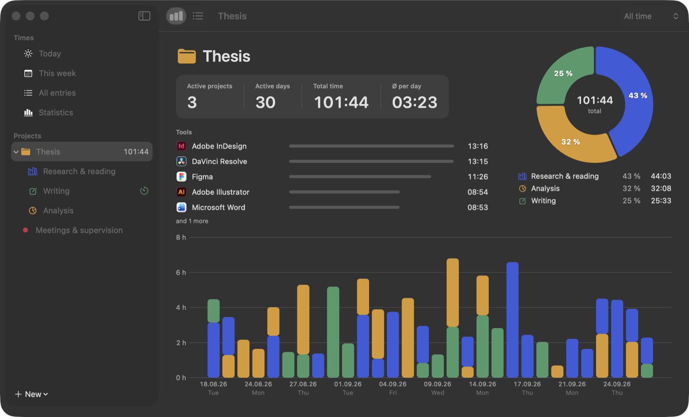
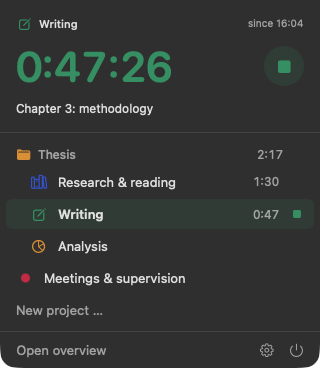
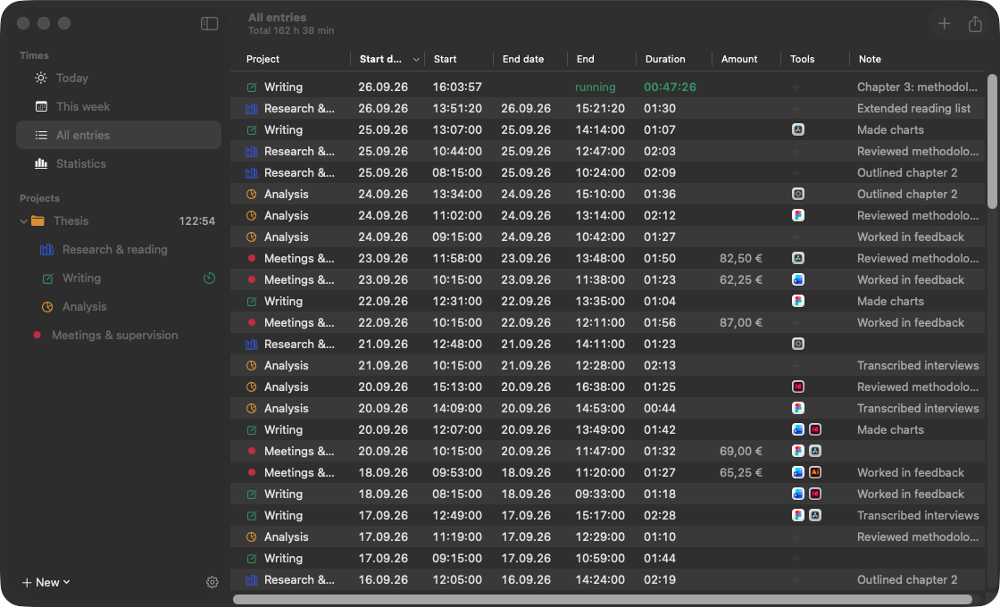
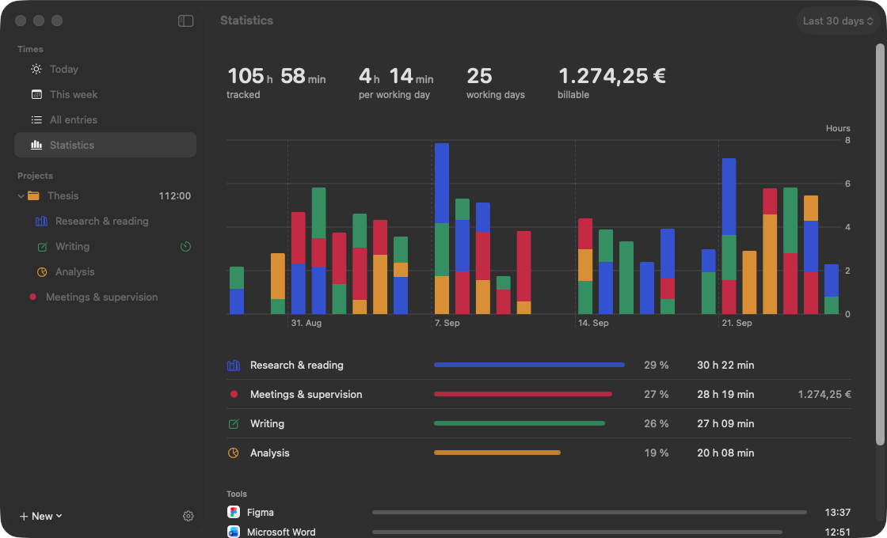

<p align="center"></p>

# TOM

**English** · [Deutsch](README.de.md)

A free, lightweight time tracker for the macOS menu bar, inspired by [Tim](https://tim.neat.software/).
Built to track the hours spent on a master's thesis, and useful for any project work: design, film, writing, study.



## Install

```sh
brew tap julianglantschnig/tom https://github.com/JulianGlantschnig/TOM
brew install --cask julianglantschnig/tom/tom
```

Then open TOM from your Applications folder. Its icon appears in the menu bar.
Update with `brew upgrade --cask tom`.

Requires macOS 15 Sequoia or later, on Apple silicon or Intel. TOM speaks English and German and follows your system language.

> TOM is not notarized by Apple (that requires a paid developer account).
> The Homebrew install removes the quarantine flag so macOS opens the app.
> If you download the ZIP from [Releases](https://github.com/JulianGlantschnig/TOM/releases) instead,
> open the app the first time with right-click → Open.

## Features



- **Menu bar timer**: click a project to start, or press **⌃⌥T** from anywhere
- **Projects and folders**: each project with a color and symbol, folders add up their projects
- **Overview** per folder and project: key figures, a ring with percentage shares, hours per day
- **Tools**: see which apps you used for each entry (Figma, DaVinci Resolve, InDesign …), with their real icons
- **Automatic detection**: notes the frontmost app while a timer runs and adds up time per tool
- **Suggested notes** from the detected apps, always editable
- **Merge entries** into one row per day, **move** them to another project by drag and drop,
  and **continue** a timer you stopped by accident
- **Archive** old projects and whole folders to hide them
- **Idle detection** (optional, per project too): subtract time you were away
- **CSV export** for Excel and Numbers, optionally rounded, with hourly rate and amount
- **Import from Tim** with all tasks, groups and times
- All data stays **on your Mac**, with an automatic backup before every update

<br clear="right">





<table>
  <tr>
    <td width="33%"></td>
    <td width="33%"></td>
    <td width="33%"></td>
  </tr>
  <tr>
    <td>Continue a timer you stopped by accident</td>
    <td>Color, symbol, folder and hourly rate per project</td>
    <td>Choose what the menu bar shows, hide the Dock icon</td>
  </tr>
</table>

See the **[guide](docs/GUIDE.md)** for how everything works.

## Support

TOM is free. If it saves you time, you can
[buy me a coffee](https://buymeacoffee.com/GlantschnigJulian), also right from the app under
Settings → Support.

## Build from source

With Xcode 26 or later:

```sh
git clone https://github.com/JulianGlantschnig/TOM.git
cd TOM
xcodebuild -project TOM.xcodeproj -target TOM -configuration Release SYMROOT=build build
cp -R build/Release/TOM.app /Applications/
```

Debug builds have a demo mode with sample data kept in memory:

```sh
xcodebuild -project TOM.xcodeproj -target TOM -configuration Debug SYMROOT=build build
build/Debug/TOM.app/Contents/MacOS/TOM -demo -demoPage folder
```

## Release a new version

```sh
scripts/release.sh 1.7
gh release create v1.7 dist/TOM-1.7.zip --title "TOM 1.7"
```

Then update `version` and `sha256` in [`Casks/tom.rb`](Casks/tom.rb) and push.

## License

[MIT](LICENSE)
