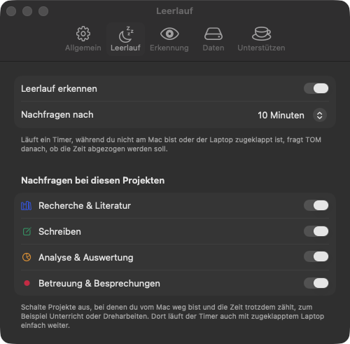

# Anleitung

[English](GUIDE.md) · **Deutsch**

## Inhalt

- [Erste Schritte](#erste-schritte)
- [Timer](#timer)
- [Projekte, Symbole und Ordner](#projekte-symbole-und-ordner)
- [Einträge](#einträge)
- [Tools und automatische Erkennung](#tools-und-automatische-erkennung)
- [Übersicht und Auswertung](#übersicht-und-auswertung)
- [Export](#export)
- [Import aus Tim](#import-aus-tim)
- [Einstellungen](#einstellungen)
- [Daten, Backup und Deinstallation](#daten-backup-und-deinstallation)
- [Unterstützen](#unterstützen)

## Erste Schritte

1. TOM starten. Es erscheint kein Fenster, sondern ein Uhr-Symbol in der Menüleiste.
2. Auf das Symbol klicken, unten „Neues Projekt …“ eintippen und mit Return bestätigen.
3. Auf das Projekt klicken, der Timer läuft. Noch ein Klick oder **⌃⌥T** stoppt ihn.
4. „Übersicht öffnen“ zeigt das Hauptfenster mit allen Zeiten.

In den Einstellungen (Zahnrad im Menü) lässt sich TOM beim Anmelden automatisch starten.

## Timer

- Es läuft immer höchstens ein Timer. Startest du ein anderes Projekt, endet der laufende Eintrag automatisch.
- **⌃⌥T** funktioniert in jeder App: stoppt den laufenden Timer oder startet das zuletzt genutzte Projekt.
- In der Menüleiste steht die laufende Zeit mit dem Symbol des Projekts.
- Im Menü kannst du während der Arbeit eine Notiz schreiben („Woran arbeitest du gerade?“).
- Einträge unter 3 Sekunden werden verworfen, damit versehentliche Klicks nicht zählen.

### Leerlauf



Warst du länger nicht am Mac (einstellbar, Standard 10 Minuten) oder war der Laptop zugeklappt,
fragt TOM danach, ob die Zeit abgezogen werden soll: abziehen und weiterlaufen, abziehen und stoppen,
oder behalten.

Einstellungen → **Leerlauf**:

- **Leerlauf erkennen** schaltet die Nachfrage ganz ein oder aus.
- **Nachfragen bei diesen Projekten**: Für Arbeit abseits des Macs, etwa Unterricht oder Dreharbeiten,
  das Projekt ausschalten. Dann einfach Play drücken, den Laptop zuklappen, und die Zeit läuft ohne
  Nachfrage weiter. Derselbe Schalter steht auch beim Bearbeiten eines Projekts.

<br clear="right">

## Projekte, Symbole und Ordner


- **Neues Projekt oder neuer Ordner:** im Hauptfenster unten links auf „+ Neu“.
- **Bearbeiten:** Rechtsklick auf das Projekt → „Bearbeiten …“. Dort gibt es Name, Farbe, **Symbol**,
  Ordner, einen optionalen Stundensatz und ob bei Leerlauf nachgefragt wird.
- **Ordner** fassen Projekte zusammen, z. B. „Diplomarbeit“. Neben dem Ordner steht die Gesamtzeit aller
  Projekte darin. Projekte lassen sich per Rechtsklick → „In Ordner verschieben“ umhängen.
- **Archivieren** blendet ein Projekt aus dem Menü aus, die Zeiten bleiben erhalten.
- **Löschen** eines Projekts löscht auch seine Einträge. Beim Löschen eines Ordners bleiben die Projekte erhalten.

## Einträge

„Heute“, „Diese Woche“ und „Alle Einträge“ zeigen eine Tabelle wie in Tim. Jede Spalte lässt sich durch
Klick auf die Überschrift sortieren.

- **Bearbeiten:** Doppelklick auf eine Zeile.
- **Zeit nachtragen:** „+“ oben rechts.
- **Löschen:** Zeile markieren und ⌫ drücken, oder Rechtsklick → „Löschen“.

### Zusammenführen

Hast du an einem Tag mehrmals denselben Timer gestartet, kannst du die Zeilen zu einer zusammenfassen:

- Rechtsklick auf eine Zeile → **„Alle Zeilen vom … zusammenführen“** fasst alle Einträge desselben Tages
  und Projekts zusammen.
- Mehrere Zeilen markieren (oder alle mit ⌘A) → **„Pro Tag zusammenführen“** macht eine Zeile pro Tag und Projekt.

Dabei wählst du:

| Variante | Beginn | Ende |
| --- | --- | --- |
| Nur Arbeitszeit behalten | erster Start | Beginn + Summe der Einträge |
| Von Beginn bis Ende, mit Pausen | erster Start | letztes Ende |

Notizen und Tools werden übernommen. Ein laufender Timer wird nie zusammengeführt.

## Tools und automatische Erkennung

Die Spalte **Tools** zeigt, mit welchen Programmen du gearbeitet hast, mit den echten App-Icons.

- **Von Hand:** Klick in die Spalte (oder im Bearbeiten-Fenster auf „Tools“) öffnet eine Liste der
  installierten Programme wie Figma, DaVinci Resolve, InDesign, Illustrator, Photoshop, Word oder VS Code.
  „Andere App wählen …“ erlaubt jede weitere App.
- **Automatisch:** Während ein Timer läuft, schaut TOM alle 5 Sekunden, welche App vorne ist.
  Beim Stoppen werden die Apps mit ihrer Zeit gespeichert, sofern sie mindestens eine Minute und einen
  spürbaren Anteil ausmachen. Beim laufenden Eintrag sind die Icons schon live zu sehen.
- Zeigt die Maus auf die Icons, steht die Zeit pro App daneben.
- Versionen zählen zusammen: „Adobe After Effects 2025“ und „2026“ sind ein Tool.
- Mehr als 3 Minuten ohne Maus oder Tastatur zählen für keine App.

**Notizvorschlag:** Aus den erkannten Apps entsteht eine Notiz wie „Figma (40 min): Screens Kapitel 3“.
Sie wird beim Stoppen nur eingetragen, wenn die Notiz leer ist. Im Menü lässt sie sich schon vorher mit
„Als Notiz übernehmen“ einsetzen und danach frei umschreiben.

**Fenstertitel (optional):** Mit dem Schalter „Auch Fenstertitel mitlesen“ steht im Vorschlag zusätzlich,
welches Dokument oder welche Webseite offen war. macOS gibt Fenstertitel anderer Apps nur mit der Freigabe
„Bildschirm- und Systemaudioaufnahme“ heraus (Systemeinstellungen → Datenschutz & Sicherheit).
TOM nimmt dabei nichts auf. Ohne diese Freigabe werden nur App-Namen erkannt.

Die Erkennung lässt sich in den Einstellungen ausschalten. Nichts davon verlässt den Mac.

## Übersicht und Auswertung

- Ein Klick auf einen **Ordner** oder ein **Projekt** zeigt die Übersicht. Oben links wechselst du zwischen
  Diagramm und Tabelle.
- Kennzahlen: aktive Projekte bzw. Einträge, aktive Tage, Gesamtzeit und Durchschnitt pro Tag.
- Der **Ring** zeigt die Anteile der Projekte in Prozent mittig in jedem Segment, in der Mitte die Gesamtzeit.
- Die **Tools**-Liste zeigt die Zeit pro Programm.
- Das **Balkendiagramm** zeigt die Stunden pro Tag, gestapelt nach Projekt.
- Oben rechts wählst du den Zeitraum: diese Woche, letzte 30 Tage, dieser Monat, dieses Jahr oder gesamt.

„Auswertung“ in der Seitenleiste fasst alle Projekte zusammen, mit Anteil, Stunden, Betrag und Tools.

## Export

Das Teilen-Symbol oben rechts in jeder Tabelle speichert die angezeigten Einträge als CSV-Datei.
Auf Deutsch nutzt sie Semikolon und Dezimalkomma und öffnet sich deshalb in Excel und Numbers direkt richtig.

Spalten: Datum, Beginn, Ende, Dauer, Stunden, Projekt, Tools, Notiz, Stundensatz, Betrag.
In den Einstellungen lässt sich das Aufrunden auf 5, 6, 15 oder 30 Minuten einschalten.

## Import aus Tim

Einstellungen → Daten → „Zeiten aus Tim“ → **Importieren**.

- Jede Tim-Aufgabe wird ein Projekt, jede Tim-Gruppe ein Ordner.
- Farben und Notizen werden übernommen.
- Der Import lässt sich gefahrlos wiederholen: bereits übernommene Einträge werden übersprungen.
- Laufende Tim-Timer werden nicht übernommen.

## Einstellungen

Die Einstellungen öffnest du über das Zahnrad im Menü. Sie haben fünf Tabs:

| Tab | Einstellung | Wirkung |
| --- | --- | --- |
| Allgemein | Beim Anmelden automatisch starten | TOM startet mit dem Mac |
| Allgemein | Sekunden in der Menüleiste zeigen | 1:05:09 statt 1:05 |
| Leerlauf | Leerlauf erkennen | Nachfrage nach Abwesenheit ein oder aus |
| Leerlauf | Nachfragen nach | 5, 10, 15, 30 Minuten oder 1 Stunde |
| Leerlauf | Nachfragen bei diesen Projekten | Ausnahmen für Arbeit abseits des Macs |
| Erkennung | Tätigkeit automatisch erkennen | Tools und Notizvorschlag aus der App im Vordergrund |
| Erkennung | Auch Fenstertitel mitlesen | Dokument- und Seitentitel im Notizvorschlag |
| Daten | Beim Export aufrunden | Dauer im CSV auf volle Minuten aufrunden |
| Daten | Währung | Zeichen für Beträge |
| Daten | Zeiten aus Tim, Datenordner | Import und Backup |
| Unterstützen | Kaffee spendieren | Öffnet die Spendenseite im Browser |

## Daten, Backup und Deinstallation

Alle Zeiten liegen in `~/Library/Application Support/TOM`. Für ein Backup diesen Ordner kopieren
(Einstellungen → „Datenordner“ → „Im Finder zeigen“).

Deinstallieren:

```sh
brew uninstall --cask tom          # nur die App
brew uninstall --zap --cask tom    # App und alle Daten
```

## Unterstützen

TOM ist kostenlos und entstand neben einer Diplomarbeit. Wer das Projekt unterstützen möchte:
Einstellungen → **Unterstützen** → „Kaffee spendieren“, oder direkt auf
[buymeacoffee.com/GlantschnigJulian](https://buymeacoffee.com/GlantschnigJulian).
