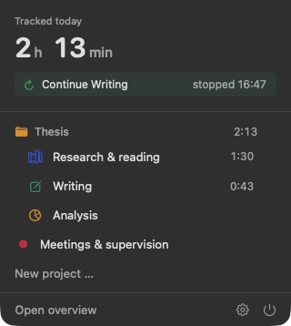
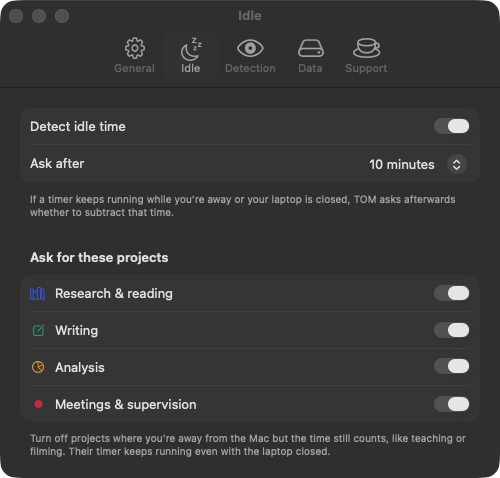
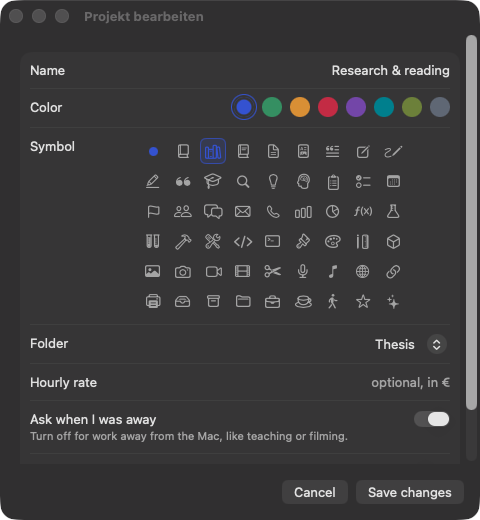
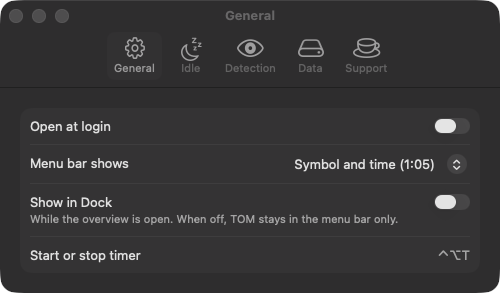

# Guide

**English** · [Deutsch](ANLEITUNG.md)

## Contents

- [Getting started](#getting-started)
- [Timer](#timer)
- [Projects, symbols and folders](#projects-symbols-and-folders)
- [Entries](#entries)
- [Tools and automatic detection](#tools-and-automatic-detection)
- [Overview and statistics](#overview-and-statistics)
- [Export](#export)
- [Import from Tim](#import-from-tim)
- [Settings](#settings)
- [Data, backup and uninstalling](#data-backup-and-uninstalling)
- [Support](#support)

## Getting started

1. Open TOM. No window appears, just a clock icon in the menu bar.
2. Click the icon, type a name into “New project …” at the bottom and press Return.
3. Click the project and the timer starts. Click again or press **⌃⌥T** to stop it.
4. “Open overview” shows the main window with all your times.

In Settings (gear icon in the menu or at the bottom left of the main window), TOM can open automatically at login.

## Timer



- Only one timer runs at a time. Starting another project ends the running entry.
- **⌃⌥T** works in any app: it stops the running timer or starts the project you used last.
- The menu bar shows the running time next to the project's symbol. In Settings → General you choose
  between h:mm (default), h:mm:ss, the time without a symbol, or the symbol only.
- You can write a note in the menu while you work (“What are you working on?”). When you edit an entry, the note
  is a text block of its own where Return starts a new paragraph.
- Entries shorter than 3 seconds are discarded, so accidental clicks don't count.
- **Stopped by accident?** For an hour after stopping, the menu shows “Continue …”. It reopens the
  entry, and the time since stopping counts too. For a real break, just start the project again.

<br clear="right">

### Idle time



If you were away from your Mac for a while (10 minutes by default) or your laptop was closed,
TOM asks afterwards what to do with that time: subtract it and keep running, subtract it and stop,
or keep it.

Settings → **Idle**:

- **Detect idle time** turns the question on or off entirely.
- **Ask for these projects**: turn a project off for work away from the Mac, like teaching or filming.
  Press play, close your laptop, and the time keeps counting without any question.
  The same switch is available when editing a project.

<br clear="right">

## Projects, symbols and folders



- **New project or folder:** click “+ New” at the bottom left of the main window.
- **Edit:** the slider button at the top right of a project (“Project settings”), right-click → “Edit …”
  in the sidebar, or right-click the project in the menu bar. You can set the name, color, **symbol**, folder,
  an optional hourly rate and whether TOM asks about idle time. The rainbow circle after the colors opens
  the macOS color wheel for a custom color.
- **Budget:** in the project settings, enter the hours agreed with a client (e.g. 30) and optionally an early
  warning (e.g. 25). While the timer runs, TOM alerts you once at the warning and once at the budget, where you
  can stop the timer right away. A bar in the menu and in the project overview shows where you stand, orange
  from the warning, red from the budget. All of the project's times count. If one client spans several
  projects, give the budget to the **folder** instead (“Edit folder”), then all projects in it count together.
- **Folders** group projects, for example “Thesis”. The folder shows the total time of all its projects.
  Move projects with right-click → “Move to folder”.
- **Archive** (right-click, or the switch in the project settings) hides a project from the menu and the list
  and keeps its times. Right-click a folder → “Archive folder” archives all of its projects at once.
  Archived items sit in the collapsed “Archive” section at the bottom of the sidebar.
- **Deleting** a project also deletes its entries. Deleting a folder keeps its projects.

## Entries

“Today”, “This week” and “All entries” show a table like in Tim. Click any column header to sort.

- **Edit:** double-click a row.
- **Add time manually:** “+” at the top right.
- **Delete:** select a row and press ⌫, or right-click → “Delete”.
- **Move to another project:** drag rows onto a project in the sidebar, or right-click → “Move to project”.
  Works with several selected rows too.
- **Continue:** right-click the last stopped entry of today → “Continue”.

### Merging

If you started the same timer several times in one day, you can combine the rows:

- Right-click a row → **“Merge all rows from …”** combines all entries of that day and project.
- Select several rows (or all with ⌘A) → **“Merge per day”** leaves one row per day and project.

You choose between:

| Option | Start | End |
| --- | --- | --- |
| Keep working time only | first start | start + sum of the entries |
| From start to end, including breaks | first start | last end |

Notes and tools are combined. A running timer is never merged.

## Tools and automatic detection

The **Tools** column shows which apps you worked with, using their real app icons.

- **Manually:** click the column (or “Tools” in the edit window) to open a list of installed apps like
  Figma, DaVinci Resolve, InDesign, Illustrator, Photoshop, Word or VS Code.
  “Choose another app …” adds any other app.
- **Automatically:** while a timer runs, TOM checks every 5 seconds which app is in front.
  When you stop, apps with at least a minute and a noticeable share are saved with their time.
  For the running entry the icons appear live.
- Hover over the icons to see the time per app.
- Versions count together: “Adobe After Effects 2025” and “2026” are one tool.
- More than 3 minutes without mouse or keyboard input count for no app.

**Suggested note:** the detected apps become a note like “Figma (40 min): Screens chapter 3”.
It is only filled in when you stop and the note is empty. In the menu you can insert it earlier with
“Use as note” and then rewrite it freely.

**Window titles (optional):** with “Also read window titles”, the suggestion also names the document or
web page that was open. macOS only shares other apps' window titles with the “Screen & System Audio
Recording” permission (System Settings → Privacy & Security). TOM doesn't record anything.
Without this permission, only app names are detected.

Detection can be turned off in Settings. None of this leaves your Mac.

## Overview and statistics

- Click a **folder** or **project** to see its overview. Switch between chart and table at the top left.
- Key figures: active projects or entries, active days, total time and average per day.
- The **ring** shows each project's share in percent inside its segment, with the total time in the middle.
- The **Tools** list shows the time per app.
- The **bar chart** shows hours per day, stacked by project.
- Choose the period at the top right: this week, last 30 days, this month, this year or all time.

“Statistics” in the sidebar sums up all projects with share, hours, amount and tools.

## Export

The share icon at the top right of every table saves the shown entries as a CSV file.
It uses your language's number format (comma-separated in English, semicolons with decimal commas in
German), so Excel and Numbers open it correctly.

Columns: date, start, end, duration, hours, project, tools, note, hourly rate, amount.
In Settings you can round up to 5, 6, 15 or 30 minutes.

## Import from Tim

Settings → Data → “Times from Tim” → **Import**.

- Every Tim task becomes a project, every Tim group a folder.
- Colors and notes are kept.
- The import is safe to repeat: entries that were already imported are skipped.
- Running Tim timers are not imported.

## Settings

Open Settings with the gear icon in the menu. There are five tabs:



| Tab | Setting | Effect |
| --- | --- | --- |
| General | Open at login | TOM starts with your Mac |
| General | Appearance | Match System, Light, or Dark |
| General | Menu bar shows | Symbol and time (1:05), with seconds, time only, or symbol only |
| General | Show in Dock | Dock icon while the overview is open; off = menu bar only |
| Idle | Detect idle time | Ask about time away, on or off |
| Idle | Ask after | 5, 10, 15, 30 minutes or 1 hour |
| Idle | Ask for these projects | Exceptions for work away from the Mac |
| Detection | Detect activity automatically | Tools and suggested note from the frontmost app |
| Detection | Also read window titles | Document and page titles in the suggested note |
| Detection | Start timer when I open an app | Starts the project whose app (project → “Starts with”) comes to the front; “Ask first” shows a prompt instead |
| Data | Round up on export | Round durations in the CSV up to full minutes |
| Data | Currency | Symbol for amounts |
| Data | Times from Tim, data folder | Import and backup |
| Support | Buy me a coffee | Opens the donation page in your browser |

## Data, backup and uninstalling

All times are stored in `~/Library/Application Support/TOM`. To back up, copy this folder
(Settings → Data → “Data folder” → “Show in Finder”).

When you start a new version for the first time, TOM automatically copies the database into the
`Backups` subfolder first. The last five backups are kept, so an update can't lose any times.

Uninstall:

```sh
brew uninstall --cask tom          # the app only
brew uninstall --zap --cask tom    # the app and all data
```

## Support

TOM is free and was made alongside a master's thesis. To support the project:
Settings → **Support** → “Buy me a coffee”, or go straight to
[buymeacoffee.com/GlantschnigJulian](https://buymeacoffee.com/GlantschnigJulian).
